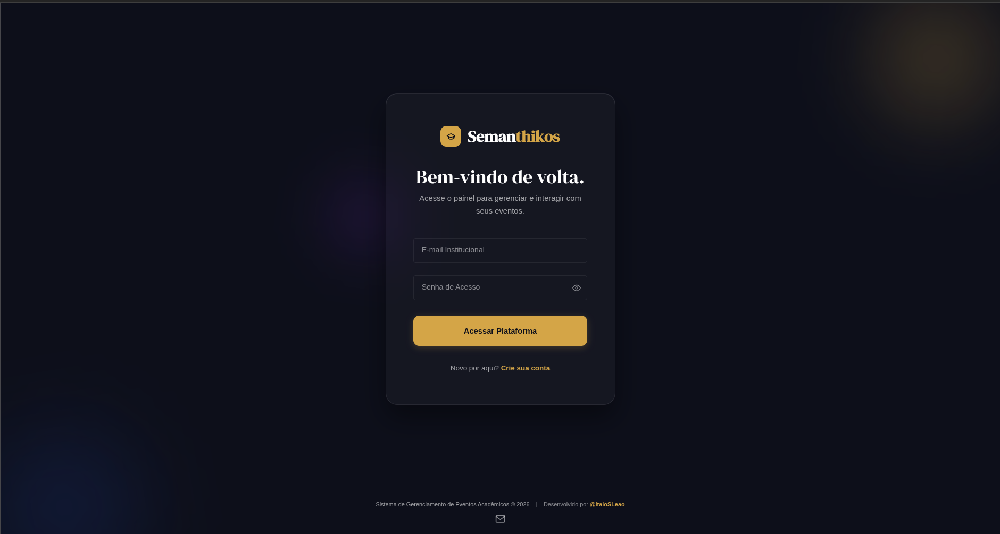
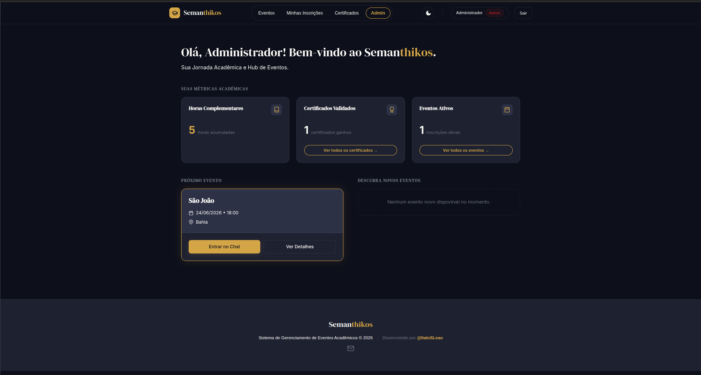
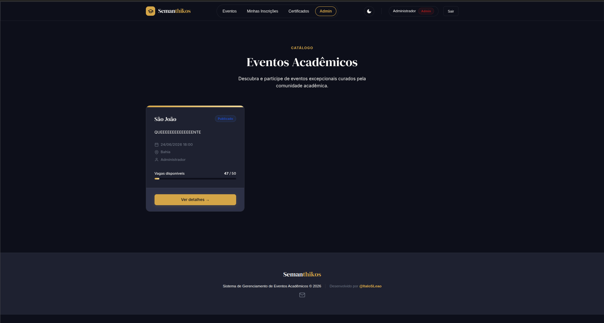
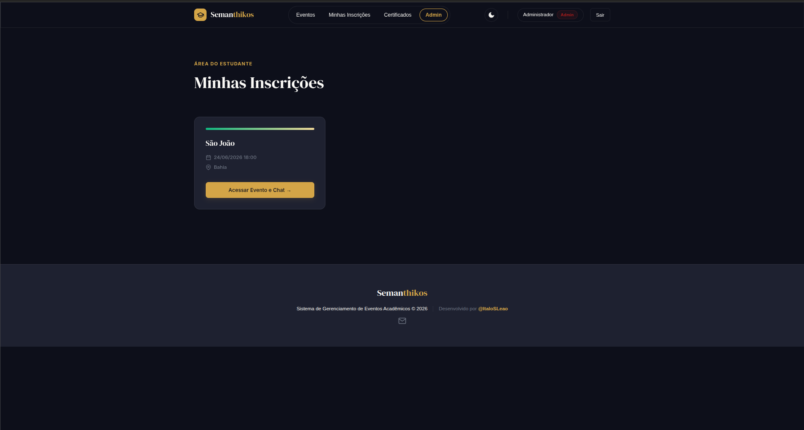
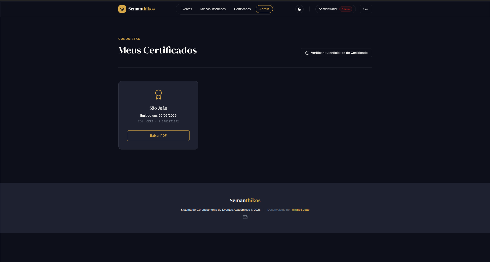
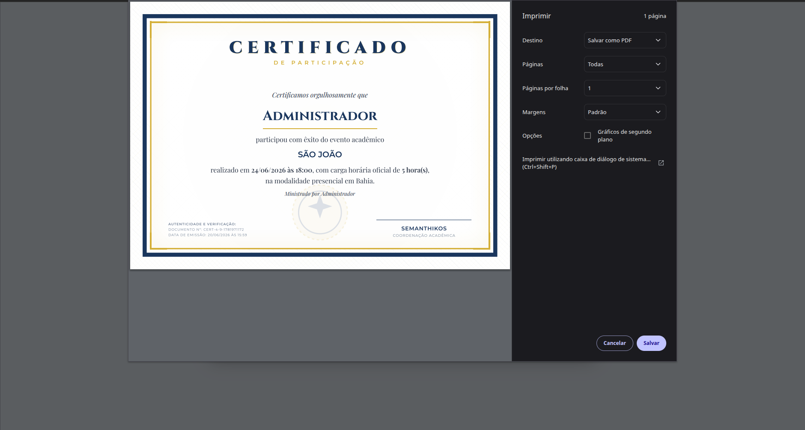
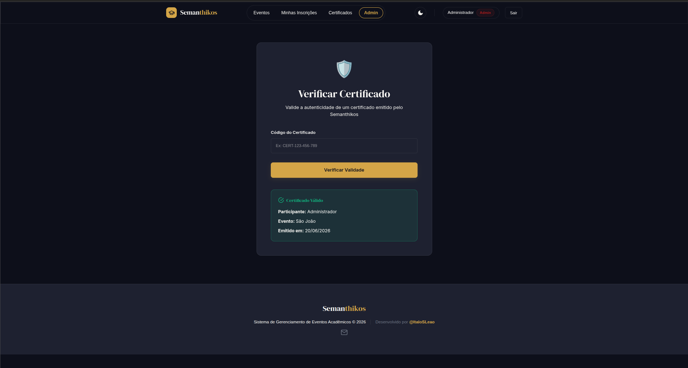
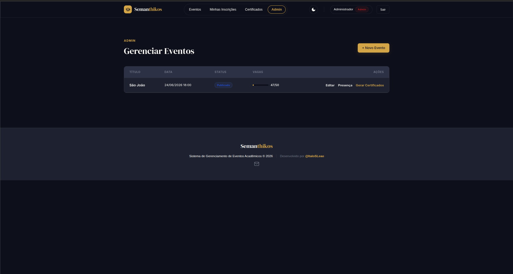
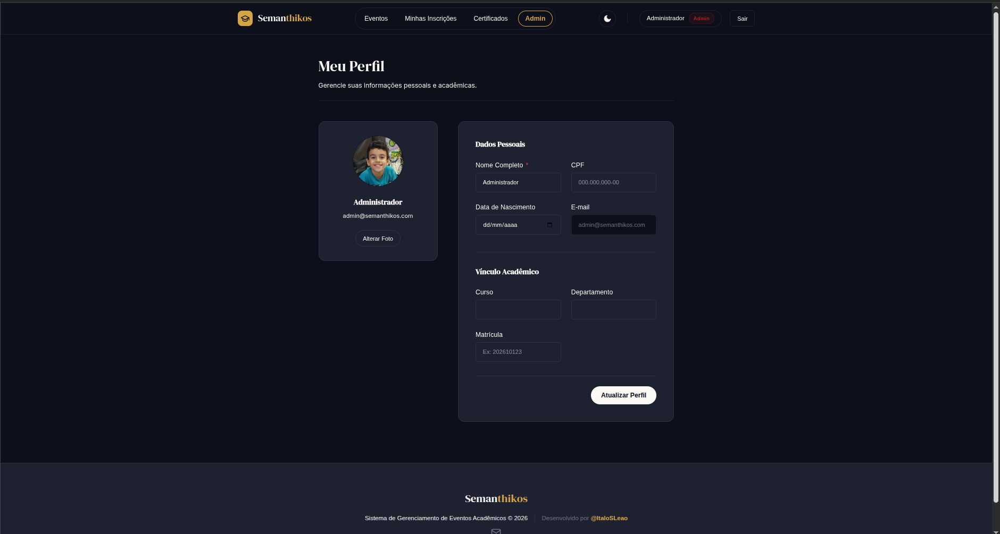
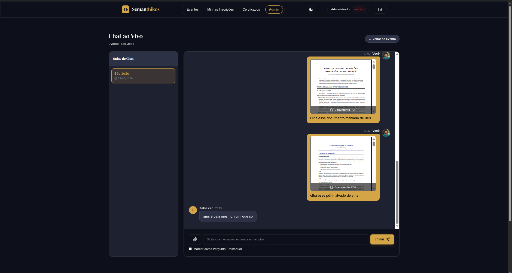

# Semanthykos - Event Manager


Sistema de gerenciamento de eventos acadêmicos desenvolvido em **Elixir** com **Phoenix Framework**, seguindo os requisitos da disciplina de Paradigmas de Linguagens de Programação (PLP).

## Visão Geral

Este sistema permite a gestão completa de eventos acadêmicos, incluindo:

- **Criação e gestão de eventos** com controle de vagas
- **Inscrições** com validação de disponibilidade em tempo real
- **Chat ao vivo** durante eventos para Q&A
- **Geração automática de certificados** em PDF
- **Dashboards e relatórios** com visualizações gráficas
- **Controle de acesso** baseado em papéis (RBAC)

### Telas












### Estrutura de Diretórios

```
lib/
├── event_manager/                    # Camada de negócio (Contexts)
│   ├── accounts/                     # Gestão de usuários
│   │   ├── user.ex                   # Schema de usuário
│   │   ├── user_token.ex             # Tokens de sessão
│   │   ├── user_notifier.ex          # Notificações por email
│   │   └── accounts.ex               # Contexto de autenticação
│   ├── events/                       # Gestão de eventos
│   │   ├── event.ex                  # Schema de evento
│   │   ├── registration.ex           # Schema de inscrição
│   │   └── events.ex                 # Contexto de eventos
│   ├── certificates/                 # Geração de certificados
│   │   ├── certificate.ex            # Schema de certificado
│   │   ├── certificates.ex           # Lógica de geração PDF
│   │   └── certificate_worker.ex     # Worker assíncrono
│   ├── notifications/                # Chat e notificações
│   │   ├── chat_message.ex           # Schema de mensagem
│   │   └── notifications.ex          # Contexto de notificações
│   ├── reports/                      # Relatórios e dashboards
│   │   └── reports.ex                # Queries complexas
│   ├── application.ex                # OTP Application
│   └── repo.ex                       # Ecto Repository
├── event_manager_web/                # Camada web
│   ├── channels/                     # Phoenix Channels
│   │   ├── user_socket.ex            # WebSocket handler
│   │   ├── event_channel.ex          # Canal de eventos
│   │   └── chat_channel.ex           # Canal de chat
│   ├── controllers/                  # HTTP Controllers
│   ├── live/                         # LiveView modules
│   ├── components/                   # UI Components
│   ├── routers/                      # Rotas
│   └── templates/                    # HTML Templates
config/                               # Configurações
priv/
├── repo/migrations/                  # Migrações do banco
├── nginx/                            # Configuração Nginx
└── static/                           # Arquivos estáticos
```

### Setup Local

```bash
# Clone o repositório
git clone https://github.com/ItaloSLeao/semanthykos-ex.git
cd event_manager

# Instale as dependências
mix local.hex --force
mix archive.install hex phx_new --force
mix deps.get

# Configure o banco de dados
# Edite config/dev.exs com suas credenciais do PostgreSQL

# Crie e popule o banco
mix ecto.setup

# Instale assets
mix assets.setup
mix assets.build

# Inicie o servidor
mix phx.server
```

Acesse: http://localhost:4000

### Comandos Principais

```bash
# Servidor com reload automático
mix phx.server

# Servidor interativo (IEx)
iex -S mix phx.server

# Console do banco
mix ecto.migrate

# Resetar banco
mix ecto.reset

# Executar testes
mix test

# Formatar código
mix format

# Verificar warnings
mix compile --warnings-as-errors
```

## Checklist de Implementacao - Estado Atual

Legenda: `[x]` implementado, `[ ]` pendente, `(Parcial)` existe no codigo, mas ainda precisa acabamento, testes ou correcao.

### 1. Autenticacao e Autorizacao

Cadastro e Login

- [x] Cadastro de usuarios
- [x] Login com e-mail e senha
- [x] Logout
- [x] Recuperacao de senha
- [x] Hash seguro de senhas com Bcrypt

Controle de Papeis (RBAC)

- [x] Papel: Aluno (`student`)
- [x] Papel: Palestrante (`speaker`)
- [x] Papel: Administrador (`admin`)
- [x] Middleware de autorizacao (`UserAuth`)
- [x] Restricao de acesso por funcao nas rotas admin/speaker

Permissoes

- [x] Admin pode criar eventos
- [x] Admin pode editar eventos
- [x] Admin pode excluir eventos
- [x] Usuarios podem visualizar eventos
- [x] Alunos podem se inscrever em eventos

Notas: existem atalhos de prototipo que precisam ser removidos antes de producao: criacao automatica de admin na tela de login e sobrescrita do palestrante no cadastro de evento.

### 2. Gestao de Eventos

CRUD de Eventos

- [x] Criar evento
- [x] Listar eventos
- [x] Visualizar detalhes do evento
- [x] Editar evento
- [x] Excluir evento

Dados do Evento

- [x] Titulo
- [x] Descricao
- [x] Data
- [x] Horario via campo `date` (`utc_datetime`)
- [x] Local
- [x] Quantidade de vagas
- [x] Palestrante responsavel
- [x] Imagem/banner do evento via `image_url`

Regras de Negocio

- [x] Validar capacidade maxima
- [x] Impedir overbooking de vagas confirmadas
- [ ] (Parcial) Encerrar inscricoes quando lotado
- [x] Lista de espera quando lotado

Notas: atualmente, quando o evento lota, novas inscricoes podem entrar como `waitlisted`; portanto nao ha encerramento total de inscricoes, e a UI ainda precisa comunicar melhor esse status.

### 3. Sistema de Inscricoes

Participacao

- [x] Inscricao em evento
- [x] Cancelamento de inscricao
- [x] Listagem de inscritos
- [x] Historico de participacao do usuario

Controle de Vagas

- [x] Contagem automatica de vagas restantes
- [x] Bloqueio de overbooking
- [x] Lista de espera

### 4. Certificados

Geracao Automatica

- [x] Gerar certificado apos participacao marcada
- [x] Template de certificado
- [x] Inserir nome do participante
- [x] Inserir nome do evento
- [x] Inserir data do evento

Exportacao

- [ ] (Parcial) Download em PDF
- [x] Historico de certificados emitidos

Notas: o sistema gera HTML de certificado em `pdf_data` e faz download inline como HTML. A dependencia `pdf_generator` existe, mas a exportacao PDF real ainda nao esta integrada.

### 5. Recursos em Tempo Real (Phoenix Channels)

Chat do Evento

- [x] Sala de chat por evento
- [x] Envio de mensagens
- [x] Recebimento em tempo real
- [ ] (Parcial) Exibicao de usuarios conectados

Notificacoes

- [ ] (Parcial) Evento lotado/capacidade via canal de notificacoes
- [x] Nova inscricao via broadcast de atualizacao
- [ ] (Parcial) Lembrete de evento proximo via funcao de broadcast
- [x] Atualizacoes em tempo real na ocupacao

Notas: `Presence` esta configurado, mas a exibicao de conectados no chat ainda nao aparece como funcionalidade completa.

### 6. Relatorios e Dashboards

Dashboard Administrativo

- [x] Total de eventos
- [x] Total de usuarios
- [x] Total de inscricoes
- [x] Taxa de ocupacao

Relatorios

- [x] Participacao por curso
- [x] Participacao por departamento
- [x] Eventos mais populares por ocupacao/inscricoes
- [x] Relatorio de presenca

Visualizacoes

- [x] Grafico/visualizacao de ocupacao
- [x] Grafico/visualizacao de inscricoes por periodo
- [x] Indicadores (KPIs)

Exportacao

- [x] Exportar CSV
- [ ] Exportar PDF

### 7. Upload de Arquivos

Upload de Imagens

- [ ] (Parcial) Upload de banner do evento
- [x] Validacao de formato no upload do chat
- [x] Limite de tamanho no upload do chat
- [ ] (Parcial) Armazenamento seguro

Servir Arquivos

- [x] Configuracao para arquivos estaticos
- [x] Exibicao de imagens dos eventos via `image_url`

Notas: existe upload de avatar e anexos do chat. Banner de evento esta modelado como URL, mas ainda nao ha fluxo dedicado de upload validado para eventos.

### 8. Busca e Consultas Avancadas

Pesquisa

- [x] Busca por nome do evento
- [x] Busca por palestrante
- [x] Busca por local

Full-Text Search

- [x] Busca em titulo
- [x] Busca em descricao
- [x] Indices PostgreSQL para desempenho

Consultas Complexas

- [x] Joins entre usuarios, eventos e inscricoes
- [x] Agregacoes para relatorios
- [x] Subconsultas/queries para metricas

Notas: `Core.search_events/1` usa full-text em titulo/descricao e filtros por local/palestrante, exposto no catalogo de eventos.

### 9. Banco de Dados (PostgreSQL)

Modelagem

- [x] Usuarios
- [x] Perfis/Roles
- [x] Eventos
- [x] Inscricoes
- [x] Certificados
- [x] Mensagens do Chat

Relacionamentos

- [x] Usuario <-> Inscricao
- [x] Evento <-> Inscricao
- [x] Evento <-> Palestrante
- [x] Usuario <-> Certificado

Performance

- [x] Indices
- [x] Constraints
- [x] Foreign Keys

### 10. Infraestrutura

Phoenix

- [x] Estrutura MVC
- [x] Contexts organizados
- [x] APIs internas

Nginx

- [x] Reverse Proxy configurado
- [x] Servir arquivos estaticos
- [x] Compressao Gzip
- [x] HTTPS extra via arquivo de parametros SSL

### 11. Frontend

Interface

- [x] Pagina inicial
- [x] Catalogo de eventos
- [x] Detalhes do evento
- [x] Area do usuario
- [x] Painel administrativo

UX

- [x] Responsivo
- [x] Feedback visual
- [ ] (Parcial) Loading states
- [x] Tratamento de erros basico via flash/changesets

### 12. Qualidade

Testes

- [ ] (Parcial) Testes unitarios
- [ ] (Parcial) Testes de contexto
- [ ] (Parcial) Testes de autenticacao
- [ ] (Parcial) Testes de regras de negocio

Seguranca

- [x] Protecao contra SQL Injection via Ecto
- [x] Protecao CSRF
- [x] Validacao de inputs
- [x] Controle de permissoes

Notas: `mix compile --warnings-as-errors` passa. `mix test` possui 1 teste e ele falha hoje no acesso ao chat por sessao de teste invalida/redirect.

## MVP - Estado Atual

- [x] Login e cadastro
- [x] Controle de papeis
- [x] CRUD de eventos
- [x] Sistema de inscricoes
- [x] Controle de vagas
- [x] Dashboard simples
- [ ] (Parcial) Certificados em PDF
- [x] Chat em tempo real
- [x] Busca de eventos
- [x] Deploy com Phoenix + PostgreSQL + Nginx documentado/configurado

## Proximas Prioridades Sugeridas

1. Corrigir a suite de testes e adicionar helpers de login para LiveView.
2. Remover atalhos de prototipo: admin criado no login e palestrante sobrescrito ao criar evento.
3. Implementar PDF real para certificados.
4. Adicionar upload validado de banner do evento.
5. Completar Presence no chat com lista de usuarios conectados.
